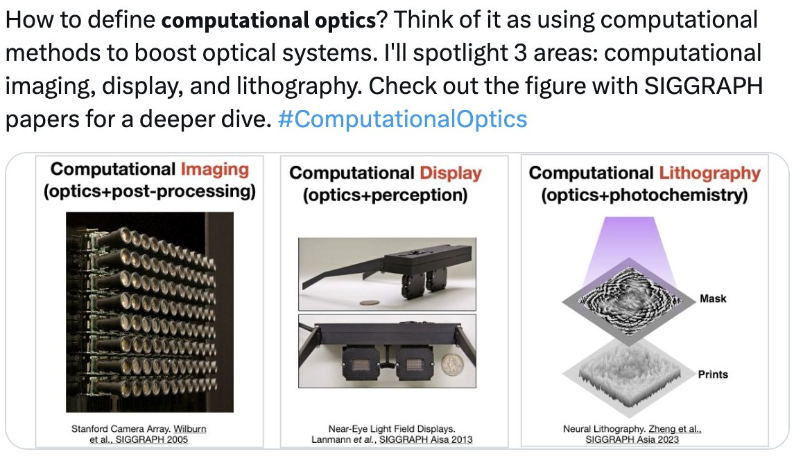

# Awesome-SIGGRAPH-Computational-Optics

A curated list that tracks Computational Optics papers from SIGGRAPH(NA/Asia) conferences.

> Note: In Sep 2023, we changed the repo title from "Computational Imaging" to "Computational Optics" to better reflect the broader scope.

## Purpose

SIGGRAPH has been publishing cutting-edge Computational Optics papers for decades. However, as it's a relatively niche area within SIGGRAPH (typically <10 papers/year), tracking these papers can be challenging. This curated list aims to:

1. Help researchers stay up-to-date with developments in the field;
2. Provide an entry point for those new or curious about Computational Optics;
3. Highlight key papers and their contributions.

## Overview

Computational Optics encompasses three main areas:

- 📷 **Computational Imaging** - Camera-based techniques
- 📺 **Computational Display** - Projector/display-based techniques  
- 🔨 **Computational Lithography** - Fabrication-based techniques

This collection also includes related papers that don't strictly fit these categories but are relevant to computational optics (e.g., 🔄 **differentiable rendering**).

## Papers

|Year|Venue|Paper(w/ code)|Repo (if any)|Labels|Summary(if any)|
|---|---|---|---|---|---|
|2024|SIGA|[AR-DAVID: Augmented Reality Display Artifact Video Dataset](https://www.cl.cam.ac.uk/research/rainbow/projects/ardavid/)|&nbsp;|`📺 display`||
|||[Large Étendue 3D Holographic Display with Content-adpative Dynamic Fourier Modulation](https://bchao1.github.io/holo_dfm/)|&nbsp;|`📺 display`||
|||[Inverse Rendering for Tomographic Volumetric Additive Manufacturing](https://dl.acm.org/doi/10.1145/3687924)|[code](https://github.com/rgl-epfl/drtvam.git)|`🔨 lithography`;`🔄 differentiable rendering`||
|||[A Generalized Ray Formulation For Wave-Optics Rendering](https://ssteinberg.xyz/2023/03/27/rtplt/)|[code](https://github.com/ssteinberg/PLTFalcor)|`🔄 differentiable rendering`||
|||[End-to-End Hybrid Refractive-Diffractive Lens Design with Differentiable Ray-Wave Model](https://arxiv.org/abs/2406.00834)|&nbsp;|`📷 imaging`||
|||[A Plenoptic 3D Vision System](https://akasha-imaging.github.io/plenoptic-vision/static/pdfs/paper.pdf)|&nbsp;|`📷 imaging`||
|||[Reconstructing Translucent Thin Objects from Photos](https://research.nvidia.com/publication/2024-11_reconstructing-translucent-thin-objects-photos)|&nbsp;|`📷 imaging`||
|||[From Sim-to-Real: Toward General Event-based Low-light Frame Interpolation with Per-scene Optimization](https://openimaginglab.github.io/Sim2Real/)|[code](https://github.com/openimaginglab/Sim2Real)|`📷 imaging`||
|||[End-to-end Optimization of Fluidic Lenses](https://computationalsciences.org/publications/na-2024-fluidic-lenses.html)|&nbsp;|`📷 imaging`||
|||[Learned Multi-aperture Color-coded Optics for Snapshot Hyperspectral Imaging](https://light.princeton.edu/publication/array-hsi/)|&nbsp;|`📷 imaging`||
|2024|SIG|[Zero Grads: Learning Local Surrogate Losses for Non-Differentiable Graphics](https://mfischer-ucl.github.io/zerograds/)|[colab](https://colab.research.google.com/drive/1GNd6DdRGRHQjKyG3rIfJ9519lo9VuAq4?usp=sharing)|`🔄 differentiable rendering`||
|||[Deep Hybrid Camera Deblurring for Smartphone Cameras](https://cg.postech.ac.kr/research/HCDeblur/)|[code](https://github.com/rimchang/HCDeblur)|`📷 imaging`||
|||[NeuralTO: Neural Reconstruction and View Synthesis of Translucent Objects](https://dl.acm.org/doi/10.1145/3658186)|&nbsp;|`📷 imaging`||
|||[Spin-Weighted Spherical Harmonics for Polarized Light Transport ](https://vclab.kaist.ac.kr/siggraph2024/index.html)|[code](https://github.com/KAIST-VCLAB/polarized-spherical-harmonics)|`📷 imaging`; `🔄 differentiable rendering`||
|||[A Free-Space Diffraction BSDF](https://ssteinberg.xyz/2024/04/05/free_space_diffractions_bsdf/)|[code](https://github.com/ssteinberg/fsdBSDFpaper)|`🔄 differentiable rendering`||
|||[Holographic Parallax Improves 3D Perceptual Realism](https://www.computationalimaging.org/publications/holographic-parallax/)|&nbsp;|`📺 display`||
|2023|SIGA|[Multisource Holography](https://dl.acm.org/doi/10.1145/3618380)|&nbsp;|`📺 display`||
|||[Depolarized Holography with Polarization-multiplexing Metasurface](https://arxiv.org/abs/2309.14668)|&nbsp;|`📺 display`||
|||[Thin On-Sensor Nanophotonic Array Cameras](https://light.princeton.edu/publication/thin-on-sensor-nanophotonic-array-cameras/)|&nbsp;|`📷 imaging`||
|||[Neural Lithography: Close the Design to Manufacturing Gap in Computational Optics with a 'Real2Sim' Learned Photolithography Simulator](https://neural-litho.github.io/)|[code](https://github.com/neural-litho/neural-lithography)|`🔨 lithography`; `📷 imaging`; `📺 display`||
|||[Holographic Near-eye Display with Real-time Embedded Rendering](https://dl.acm.org/doi/10.1145/3610548.3618179)|&nbsp;|`📺 display`||
|||[Simultaneous Color Computer Generated Holography](https://arxiv.org/abs/2303.11287)|&nbsp;|`📺 display`||
|||[High-quality Color-animated CGH Using a Motor-driven Photomask](https://dl.acm.org/doi/10.1145/3610543.3626182)|&nbsp;|`📺 display`||
|||[The Effect of Display Capabilities on the Gloss Consistency Between Real and Virtual Objects](https://stereohdrgloss.mpi-inf.mpg.de/)|&nbsp;|`📺 display`||
|||[Multi-color Holograms Improve Brightness in Holographic Displays](https://arxiv.org/abs/2303.11287)|&nbsp;|`📺 display`||
|||[Light-Efficient Holographic Illumination for Continuous-Wave Time-of-Flight Imaging](https://dl.acm.org/doi/10.1145/3610548.3618152)|&nbsp;|`📷 imaging`||
|||[Self-Calibrating, Fully Differentiable NLOS Inverse Rendering](http://vclab.kaist.ac.kr/siggraphasia2023/nlospaper23-7.pdf)|[code](https://github.com/KAIST-VCLAB/nlos-inverse-rendering)|`📷 imaging`||
|||[Neural Spectro-polarimetric Fields](https://arxiv.org/abs/2306.12562)|&nbsp;|`📷 imaging`||
|||[Doppler Time-of-Flight Rendering](https://juhyeonkim95.github.io/project-pages/dopplertof/)|[code](https://github.com/juhyeonkim95/dopplertof)|`📷 imaging`||
|2023|SIG|[Computational Long Exposure Mobile Photography](https://motion-mode.github.io/)|&nbsp;|`📷 imaging`||
|||[The Statistics of Eye Movements and Binocular Disparities in VR Gaming Headsets Should Drive Headset Design](https://dl.acm.org/doi/10.1145/3610548.3618153)|&nbsp;|`📺 display`||
|||[Etendue Expansion in Holographic Near Eye Displays Through Sparse Eye-box Generation Using Lens Array Eyepiece](https://dl.acm.org/doi/10.1145/3592441)|&nbsp;|`📺 display`||
|||[OpenMPD: A Low-level Presentation Engine for Multimodal Particle-based Displays](https://discovery.ucl.ac.uk/id/eprint/10169091/)|&nbsp;|`📺 display`||
|||[Perceptual Visibility Model for Temporal Contrast Changes in Periphery](https://dl.acm.org/doi/full/10.1145/3564241)|&nbsp;|`📺 display`||
|||[Perspective-correct VR Passthrough Without Reprojection](https://dl.acm.org/doi/10.1145/3588432.3591534)|&nbsp;|`📺 display`||
|||[Split-Lohmann Multifocal Displays](https://imaging.cs.cmu.edu/split_lohmann/)|[code](https://github.com/Image-Science-Lab-cmu/SplitLohmann)|`📺 display`||
|||[Seeing Photons in Color](https://dl.acm.org/doi/10.1145/3592438)|&nbsp;|`📷 imaging`||
|||[∇-Prox: Differentiable Proximal Algorithm Modeling for Large-scale Optimization](https://light.princeton.edu/publication/delta_prox/)|[code](https://github.com/princeton-computational-imaging/Delta-Prox)|`📷 imaging`||
|2022|SIGA|[Self-Calibrating, Fully Differentiable NLOS Inverse Rendering](http://vclab.kaist.ac.kr/siggraphasia2023/nlospaper23-7.pdf)|[code](https://github.com/KAIST-VCLAB/nlos-inverse-rendering)|`📷 imaging`||
|||[Pupil-aware Holography](https://arxiv.org/abs/2203.14939)|&nbsp;|`📺 display`||
|||[Neural Photo-Finishing](https://light.princeton.edu/publication/neural-photo-finishing/)|&nbsp;|`📷 imaging`||
|||[Simulation of Hand Anatomy Using Medical Imaging](https://viterbi-web.usc.edu/~jbarbic/handSystem/)|&nbsp;|`📷 imaging`||
|||[Reconstructing Hand-Held Objects from Monocular Video](https://dihuangdh.github.io/hhor/)|[code](https://github.com/dihuangdh/HHOR)|`📷 imaging`||
|||[Efficient Differentiation of Pixel Reconstruction Filters for Path-Space Differentiable Rendering](https://dl.acm.org/doi/10.1145/3550454.3555500)|&nbsp;|`🔄 differentiable rendering`||
|||[Force-Aware Interface via Electromyography for Natural VR/AR Interaction](https://dl.acm.org/doi/10.1145/3550454.3555461)|&nbsp;|`📷 imaging`||
|||[Color-Perception-Guided Display Power Reduction for Virtual Reality](https://dl.acm.org/doi/10.1145/3550454.3555473)|&nbsp;|`📺 display`||
|2022|SIG|[NeAT: Neural Adaptive Tomography](https://vccimaging.org/Publications/Ruckert2022NeAT/)||`📷 imaging`||
|&nbsp;|&nbsp;|[Sparse Ellipsometry: Portable Acquisition of Polarimetric SVBRDF and Shape](http://vclab.kaist.ac.kr/siggraph2022p1/index.html)|[code](https://github.com/KAIST-VCLAB/SparseEllipsometry)|`📷 imaging`||
|&nbsp;|&nbsp;|[Face Deblurring using Dual Camera Fusion on Mobile Phones](https://www.wslai.net/publications/fusion_deblur/)||`📷 imaging`||
|||[Holographic Glasses for Virtual Reality](https://research.nvidia.com/publication/2022-08_holographic-glasses-virtual-reality)||`📺 display`||
|||[Neural Spectro-polarimetric Fields](https://arxiv.org/abs/2203.13423)|&nbsp;|`📷 imaging`||
|||[Joint Neural Phase Retrieval and Compression for Energy- and Computation-Efficient Holography on the Edge](https://dl.acm.org/doi/abs/10.1145/3528223.3530070)||`📺 display`||
|2021|SIGA|[Neural 3D Holography](http://www.computationalimaging.org/publications/neuralholography3d/)|[code](https://github.com/computational-imaging/neural-3d-holography)|`📺 display`||
|||[Polarimetric Spatio-Temporal Light Transport Probing](https://arxiv.org/abs/2105.11609)|&nbsp;|`📷 imaging`||
|||[Reproducing Reality with a High-Dynamic-Range Multi-Focal Stereo Display](https://dl.acm.org/doi/10.1145/3478513.3480513)|&nbsp;|`📺 display`||
|||[Kaleidoscopic Structured Light](https://imaging.cs.cmu.edu/kaleidoscopic_structured_light/)|&nbsp;|`📷 imaging`||
|||[Time-Travel Rephotography](https://time-travel-rephotography.github.io/)|[code](https://github.com/Time-Travel-Rephotography/Time-Travel-Rephotography.github.io)|`📷 imaging`||
|&nbsp;|SIG|[End-to-End Complex Lens Design](https://vccimaging.org/Publications/Sun2021DiffLens/)||`🔄 differentiable rendering`; `📷 imaging`||
|&nbsp;|&nbsp;|[Imaging with local speckle intensity correlations](https://webee.technion.ac.il/people/anat.levin/papers/AltermanTOG2021SeeThrough.pdf)|[code](https://webee.technion.ac.il/)|`📷 imaging`||
|&nbsp;|&nbsp;|[Differentiable Compound Optics](https://light.princeton.edu/publication/deep_compound_optics/)||`🔄 differentiable rendering`; `📷 imaging`||
|||[A Generic Framework for Physical Light Transport](https://ssteinberg.xyz/2021/04/26/generic_physical_light_transport_framework/)||`🔄 differentiable rendering`||
|||[Monte Carlo Estimators for Differential Light Transport](https://rgl.epfl.ch/publications/Zeltner2021MonteCarlo)||`🔄 differentiable rendering`||
|||[Free-form Scanning of Non-planar Appearance with Neural Trace Photography](https://svbrdf.github.io/publications/scanner/project.html)|&nbsp;|`📷 imaging`||
|||[Low-Cost SPAD Sensing](https://light.princeton.edu/publication/cheapspad/)|[code](https://github.com/princeton-computational-imaging/CheapSPAD)|`📷 imaging`||
|||[Dirty Pixels: Towards End-to-End Image Processing and Perception](https://arxiv.org/abs/1701.06487)|&nbsp;|`📷 imaging`||
|||[Imaging with local speckle intensity correlations: theory and practice](https://dl.acm.org/doi/10.1145/3447392)|&nbsp;|`📷 imaging`||
|2020|SIGA|[Neural Holography](https://www.computationalimaging.org/publications/neuralholography/)|[code](https://github.com/computational-imaging/neural-holography)|`📺 display`||
|||[Design and Fabrication of Freeform Holographic Optical Elements](https://research.fb.com/publications/design-and-fabrication-of-freeform-holographic-optical-elements/)||`🔨 lithography`||
|&nbsp;|&nbsp;|[Learned Hardware-in-the-loop Phase Retrieval](https://light.princeton.edu/publication/hil-holography/)||`📺 display`||
|&nbsp;|&nbsp;|[Rendering Near-Field Speckle Statistics](https://imaging.cs.cmu.edu/publications/rendering-near-field-speckle-statistics-in-scattering-media/)||`🔄 differentiable rendering`||
|&nbsp;|SIG|[Local Fourier Slice Photography](https://dl.acm.org/doi/abs/10.1145/3339307)||`📷 imaging`||
|&nbsp;|&nbsp;|[Quanta Burst Photography](https://dl.acm.org/doi/pdf/10.1145/3386569.3392470)||`📷 imaging`||
|&nbsp;|&nbsp;|[One Shot 3D Photography](https://facebookresearch.github.io/one_shot_3d_photography/)|[code](https://github.com/facebookresearch/one_shot_3d_photography)|`📷 imaging`||
|&nbsp;|&nbsp;|[Non-Line-of-Sight Reconstruction using Efficient Transient Rendering](https://light.informatik.uni-bonn.de/non-line-of-sight-reconstruction-using-efficient-transient-rendering/)||`📷 imaging`||
|&nbsp;|&nbsp;|[End-to-end Learned, Optically Coded Super-resolution SPAD Camera](https://dl.acm.org/doi/abs/10.1145/3372261)||`📷 imaging`||
|2019|SIGA|[Learning Efficient Illumination Multiplexing for Joint Capture of Reflectance and Shape](https://dl.acm.org/doi/10.1145/3355089.3356492)||`📷 imaging`||
|&nbsp;|&nbsp;|[Handheld Mobile Photography in Very Low Light](http://graphics.stanford.edu/papers/night-sight-sigasia19/night-sight-sigasia19.pdf)||`📷 imaging`||
|&nbsp;|&nbsp;|[Accelerating ADMM for efficient simulation and optimization](https://dl.acm.org/doi/10.1145/3355089.3356491)|[code](https://github.com/bldeng/AA-ADMM)|`🔄 differentiable rendering`||
|&nbsp;|&nbsp;|[Learned Large Field-of-View Imaging With Thin-Plate Optics](https://dl.acm.org/doi/abs/10.1145/3355089.3356526)|[code](https://github.com/qilinsun/LearnedLargeFOV)|`📷 imaging`||
|&nbsp;|SIG|[Synthetic Defocus and Look-Ahead Autofocus for Casual Videography](https://ceciliavision.github.io/vid-auto-focus/)||`📷 imaging`||
|&nbsp;|&nbsp;|[Handheld Multi-Frame Super-Resolution](https://dl.acm.org/doi/10.1145/3306346.3323024)|[code](https://github.com/kunzmi/ImageStackAlignator)|`📷 imaging`||
|&nbsp;|&nbsp;|[A Unified Framework for Compression and Compressed Sensing of Light Fields](https://dl.acm.org/doi/abs/10.1145/3269980)||`📷 imaging`||
|&nbsp;|&nbsp;|[Hyperparameter Optimization in Black-box Image Processing](https://www.cs.princeton.edu/~fheide/proxyopt)||`📷 imaging`||
|&nbsp;|&nbsp;|[Coding Optimization for Fast Fluorescence Lifetime Imaging](https://wisionlab.com/wp-content/uploads/2019/06/ToG19_FLIM_Jongho_Combined.pdf)||`📷 imaging`||
|&nbsp;|&nbsp;|[Non-line-of-sight Imaging with Partial Occluders and Surface Normals](https://www.cs.princeton.edu/~fheide/papers/OcclusionNLOS.pdf)||`📷 imaging`||
|&nbsp;|&nbsp;|[Wave-based Non-line-of-sight Imaging using Fast fk-Migration](http://www.computationalimaging.org/publications/nlos-fk/)|[code](https://github.com/computational-imaging/nlos-fk)|`📷 imaging`||
|&nbsp;|&nbsp;|[Compact Snapshot Hyperspectral Imaging with Diffracted Rotation](https://dl.acm.org/doi/10.1145/3306346.3322946)|[code](http://vclab.kaist.ac.kr/siggraph2019/index.html)|`📷 imaging`||
|2018|SIGA|[A System for Acquiring, Processing, and Rendering Panoramic Light Field Stills](https://dl.acm.org/doi/10.1145/3272127.3275031)||`📷 imaging`||
|&nbsp;|&nbsp;|[Learning to reconstruct shape and spatially-varying reflectance from a single image](https://cseweb.ucsd.edu/~viscomp/projects/SIGA18ShapeSVBRDF/)|[code](https://github.com/lzqsd/SingleImageShapeAndSVBRDF)|`📷 imaging`||
|&nbsp;|SIG|[What Are Optimal Coding Functions for Time-of-Flight Imaging?](https://dl.acm.org/doi/10.1145/3152155)||`📷 imaging`||
|&nbsp;|&nbsp;|[Single-Photon 3D Imaging with Deep Sensor Fusion](https://dl.acm.org/doi/10.1145/3197517.3201316)||`📷 imaging`||
|&nbsp;|&nbsp;|[End-to-end Optimization of Optics and Image Processing](https://vccimaging.org/Publications/Sitzmann2018EndToEndOptics/)|[code](https://github.com/vsitzmann/deepoptics)|`🔄 differentiable rendering`; `📷 imaging`||
|&nbsp;|&nbsp;|[Megapixel Adaptive Optics](https://dl.acm.org/doi/10.1145/3197517.3201299)|[code](https://github.com/vccimaging/MegapixelAO)|`📷 imaging`||
|2017|SIGA|[Compact Single-Shot Hyperspectral Imaging Using a Prism](http://vclab.kaist.ac.kr/siggraphasia2017p2/index.html)||`📷 imaging`||
|&nbsp;|&nbsp;|[High-Quality Hyperspectral Reconstruction Using a Spectral Prior](http://vclab.kaist.ac.kr/siggraphasia2017p1/index.html)|[code](https://github.com/KAIST-VCLAB/deepcassi/)|`📷 imaging`||
|&nbsp;|&nbsp;|[DeepToF: Off-the-Shelf Real-Time Correction of Multipath Interference](http://giga.cps.unizar.es/~juliom/pubs/2017SIGA-DeepToF/)||`📷 imaging`||
|&nbsp;|&nbsp;|[Snapshot Difference Imaging using Correlation Time-of-Flight Sensors](https://light.cs.uni-bonn.de/snapshot-difference-imaging-using-time-of-flight-sensors/)|[code](https://github.com/KAIST-VCLAB/deepcassi/)|`📷 imaging`||
|&nbsp;|SIG|[CoLux: Multi-Object 3D Micro-Motion Analysis Using Speckle Imaging](https://wisionlab.com/project/colux/)||`📷 imaging`||
|&nbsp;|&nbsp;|[4D Imaging through Spray-On Optics](https://light.cs.uni-bonn.de/4d-imaging-through-spray-on-optics/)||`📷 imaging`||
|&nbsp;|&nbsp;|[Rainbow Particle Imaging Velocimetry](https://vccimaging.org/Publications/Xiong2017RainbowPIV/)|[code](https://github.com/vccimaging/RainbowPIV)|`📷 imaging`||
|&nbsp;|&nbsp;|[Epipolar Time-of-Flight Imaging](https://www.cs.cmu.edu/~ILIM/epitof/html/index.html)||`📷 imaging`||
|&nbsp;|&nbsp;|[Deep Bilateral Learning for Real-Time Image Enhancement](https://groups.csail.mit.edu/graphics/hdrnet/)||`📷 imaging`||
|2016|SIGA|[Deep Joint Demosaicking and Denoising](https://www.computationalimaging.org/publications/neuralholography/)|[code](https://github.com/computational-imaging/neural-holography)|`📷 imaging`||
|&nbsp;|&nbsp;|[Computational Bounce Flash for Indoor Portraits](http://lmurmann.net/bounceflash)||`📷 imaging`||
|&nbsp;|&nbsp;|[Burst photography for HDR and low-light imaging (HDR+)](https://static.googleusercontent.com/media/hdrplusdata.org/en//hdrplus.pdf)|[code](https://github.com/martin-marek/hdr-plus-pytorch)|`📷 imaging`||
|&nbsp;|&nbsp;|[Learning-Based View Synthesis for Light Field Cameras](https://cseweb.ucsd.edu/~viscomp/projects/LF/papers/SIGASIA16/)||`📷 imaging`||
|&nbsp;|&nbsp;|[Birefractive Stereo Imaging for Single-Shot Depth Acquisition](http://lmurmann.net/bounceflash)||`📷 imaging`||
|&nbsp;|&nbsp;|[Model-Based Teeth Reconstruction](https://vcai.mpi-inf.mpg.de/projects/MZ/Papers/SGASIA2016_TR/page.html)||`📷 imaging`||
|&nbsp;|&nbsp;|[Recovering Shape and Spatially-Varying Surface Reflectance](https://www.cs.wm.edu/~ppeers/showPublication.php?id=Xia:2016:RSS)||`📷 imaging`||
|&nbsp;|&nbsp;|[Simultaneous Acquisition of Microscale Reflectance and Normals](http://www.minhkim.org/siggraphasia2016p2/index.html)||`📷 imaging`||
|&nbsp;|&nbsp;|[Motion Parallax in Stereo 3D](https://resources.mpi-inf.mpg.de/StereoParallax/)||`📺 display`||
|&nbsp;|SIG|[The Diffractive Achromat: Full-Spectrum Computational Imaging With Diffractive Optics ](http://www.cs.ubc.ca/labs/imager/tr/2016/DiffractiveAchromatImaging/)||`📷 imaging`||
|&nbsp;|&nbsp;|[Practical Multispectral Lighting Reproduction](https://dl.acm.org/doi/10.1145/2897824.2925934)||`📺 display`||
|&nbsp;|&nbsp;|[Computational Imaging With Multi-Camera Time-of-Flight Systems](http://www.computationalimaging.org/publications/multi-camera-time-of-flight-systems/)||`📷 imaging`||
|&nbsp;|&nbsp;|[Occluded Imaging With Time-of-Flight Sensors](https://dl.acm.org/doi/10.1145/2836164)||`📷 imaging`||
|&nbsp;|&nbsp;|[Additive Light-Field Displays: Realization of Augmented Reality With Holographic Optical Elements](http://oeqelab.snu.ac.kr/AdditiveLightFieldDisplays)||`📺 display`||
|&nbsp;|&nbsp;|[Fairy Lights in Femtoseconds: Aerial and Volumetric Graphics Rendered by a Focused Femtosecond Laser Combined With Computational Holographic Fields](https://arxiv.org/abs/1506.06668)||`📺 display`||
|&nbsp;|&nbsp;|[Image Perforation: Automatically Accelerating Image Pipelines by Intelligently Skipping Samples ](https://arxiv.org/abs/1506.06668)||`📷 imaging`||
|&nbsp;|&nbsp;|[Automatically Scheduling Halide Image Processing Pipelines](http://graphics.cs.cmu.edu/projects/halidesched/)||`📷 imaging`||
|&nbsp;|&nbsp;|[ProxImaL: Efficient Image Optimization using Proximal Algorithms](http://graphics.stanford.edu/~niessner/heide2016proximal.html)||`📷 imaging`||
|&nbsp;|&nbsp;|[Rigel: Flexible Multi-Rate Image Processing Hardware](http://graphics.stanford.edu/papers/rigel/)||`📷 imaging`||
|2015|SIGA|[Data-Driven Structural Priors for Shape Completion](https://dl.acm.org/doi/10.1145/2816795.2818094)||`📷 imaging`||
|&nbsp;|&nbsp;|[Autoscanning for Coupled Scene Reconstruction](http://kevinkaixu.net/projects/pr2scene.html)||`📷 imaging`||
|&nbsp;|&nbsp;|[Unsynchronized structured light](http://mesh.brown.edu/unsync/)||`📷 imaging`||
|&nbsp;|SIG|[Homogeneous Codes for Energy Efficient Illumination and Imaging](http://www.cs.cmu.edu/~motoole2/energyefficientimaging.html)||`📷 imaging`||
|&nbsp;|&nbsp;|[Doppler Time-of-Flight Imaging](http://www.cs.ubc.ca/labs/imager/tr/2015/DopplerToF/)||`📷 imaging`||
|&nbsp;|&nbsp;|[Phasor Imaging: A Generalization of Correlation-Based Time-of-Flight Imaging](https://cave.cs.columbia.edu/projects/categories/project?cid=Computational+Imaging&pid=Phasor+Imaging)||`📷 imaging`||
|&nbsp;|&nbsp;|[Micron-scale Light Transport Decomposition Using Interferometry](http://vision.seas.harvard.edu/transient/)||`📷 imaging`||
|&nbsp;|&nbsp;|[Linear volumetric focus for light field cameras](https://roboticimaging.org/Papers/Dansereau2015volumetric.pdf)||`📷 imaging`||
|&nbsp;|&nbsp;|[A Light Transport Framework for Lenslet Light Field Cameras](https://dl.acm.org/doi/10.1145/2665075)||`📷 imaging`||
|&nbsp;|&nbsp;|[Improving Light Field Camera Sample Design](https://www.liyiwei.org/papers/sample-sig15/)||`📷 imaging`||
|&nbsp;|&nbsp;|[Light Field Reconstruction Using Sparsity](https://groups.csail.mit.edu/netmit/LFSparseRecon/)||`📷 imaging`||
|&nbsp;|&nbsp;|[Layered Light-Field Reconstruction for Defocus Blur](https://www.intel.com/content/www/us/en/developer/overview.html#gs.8snifj)||`📷 imaging`||

[Previous years' entries continue in same format...]

## Contributing

If you have suggestions for this list, please do one of the following:
- Open an issue;
- Submit a pull request;
- Email the maintainer.

## TODO
- [x] Initial collection of papers
- [ ] Find omitted papers
- [ ] Complete paper tracking for past years before 2015
- [ ] Add paper summaries

## Resources
- [Ken-sen SIGGRAPH Papers Database](https://kesen.realtimerendering.com/)
- [Github TOC Sidebar Extension](https://github.com/reorx/github-toc-sidebar) (Recommended for browsing)
